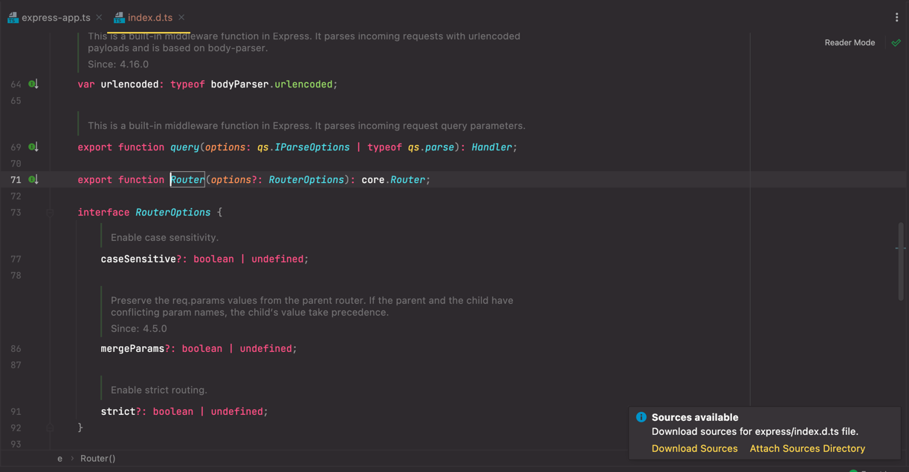
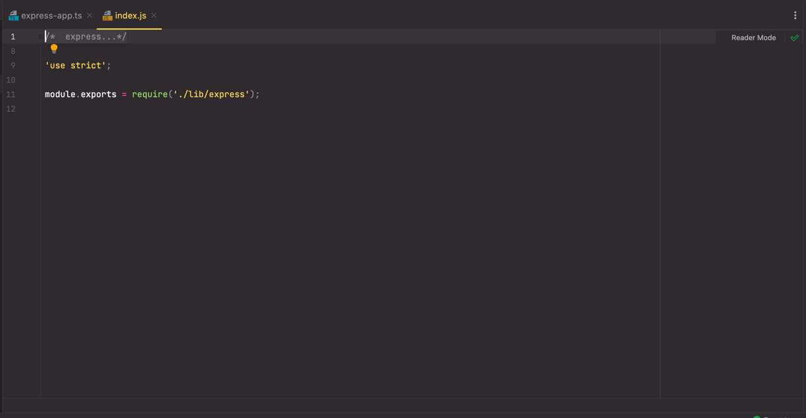
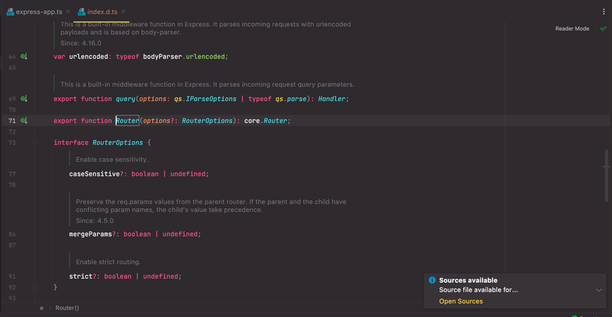
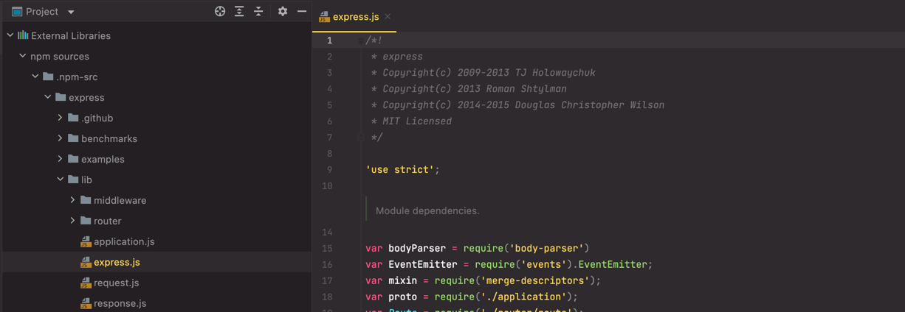

#  Source Wizard
### Introduction
Source Wizard is a plugin which helps you to access sources of your `node_module` dependencies

* It allows you to cache sources of npm modules in your local directory with the 
ability to navigate to the sources when a file from `node_modules` is opened
* Attaches source cache directory to project file tree view where you can explore the code of dependencies you use

### Usage
#### Main use cases
When file from `node_modules` directory is opened, popup appears with the selection either to download sources
from git repository or to create symlink in source cache directory if you already have the files on your computer.


If you press **Download sources**, needed sources are downloaded to your local cache from git repository
and source file of a file opened in `node_modules` is displayed.


If you press **Attach sources directory** you will be prompted to select source directory on your computer.
After the selection symlink in source cache directory is created and source file of a file opened in `node_modules` is displayed.

When file from `node_modules` directory is opened, and you already have sources directory for it in your cache, you will get
a popup asking if you want to open source file.

After pressing **Open sources** source file of a file opened in `node_modules` is displayed.

Source cache directory is accessible in file tree view under `External Libraries` tab, where you can freely explore
source code of dependencies you use:


Plugin refreshes source cache directory by performing `git pull` in the background everytime you open
source file, therefore cache is always up-to-date with the state of git repositories.

>Sources are downloaded as the latest code in the repository, because of that 
> they might differ from the code in published npm module, if you are not using 
> the latest dependency version

Plugin uses SSH connection for git so please be sure you have correct SSH key set up if you want to access sources
of private repositories.

>Be aware that npm modules sources are resolved from `repository.json` field in its package json file:
```json
 "repository": {
    "url": "https://github.com/repository"
  }
```
>Plugin will not be able to download sources for modules not containing repository info in their package json files.**

#### DefinitelyTyped support
Some npm modules are just type definitions without actual source code, for example **DefinitelyTyped** is 
a popular repository providing npm modules with type definitions of common libraries. Such modules have 
url linking to DefinitelyTyped repository instead of a repository with library sources in their package.json
file, however this plugin handles such cases, resolves and downloads actual implementation of the module.

